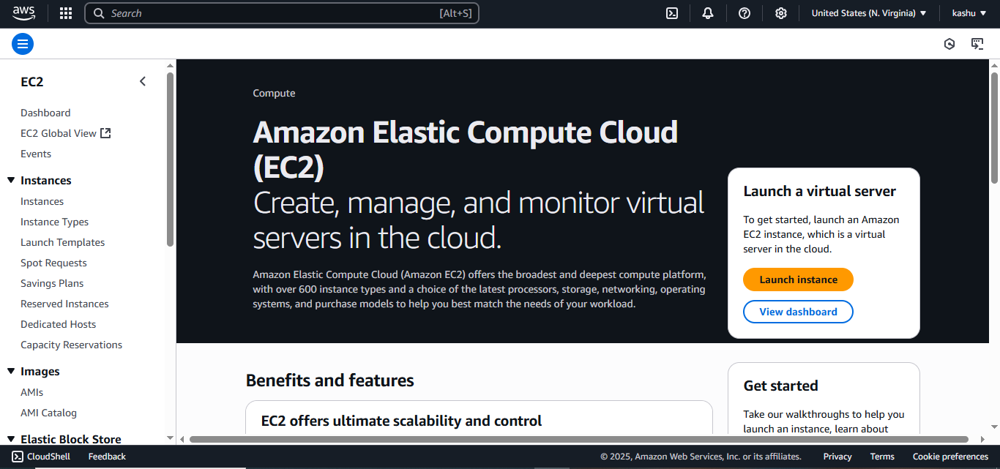
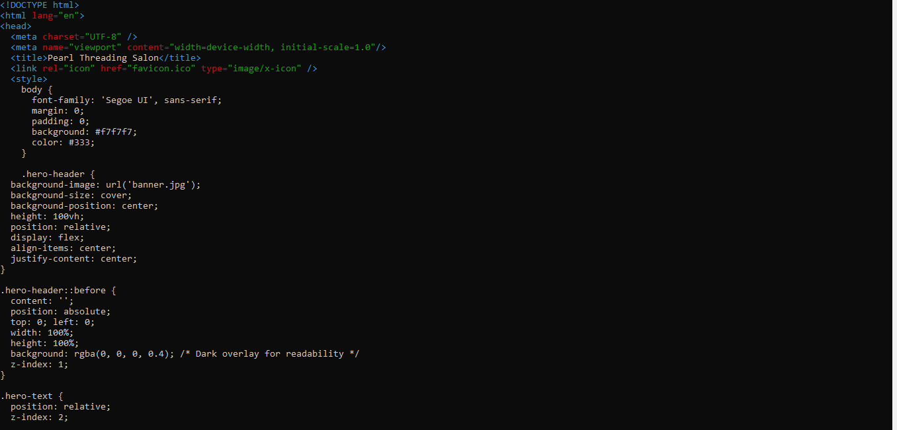
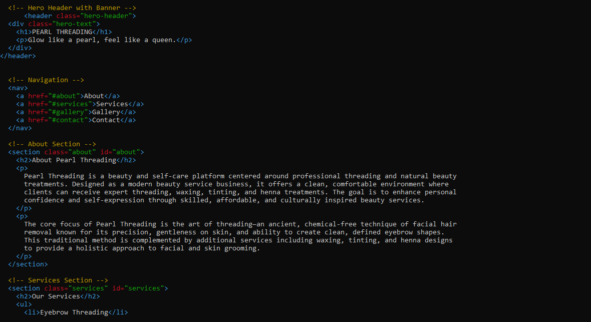
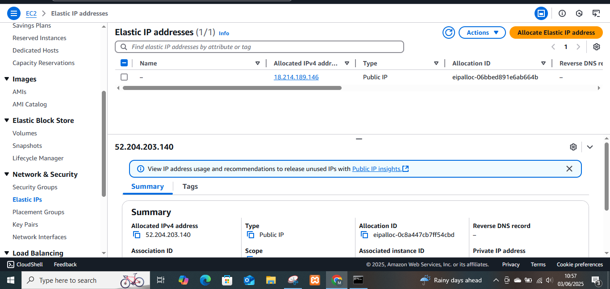
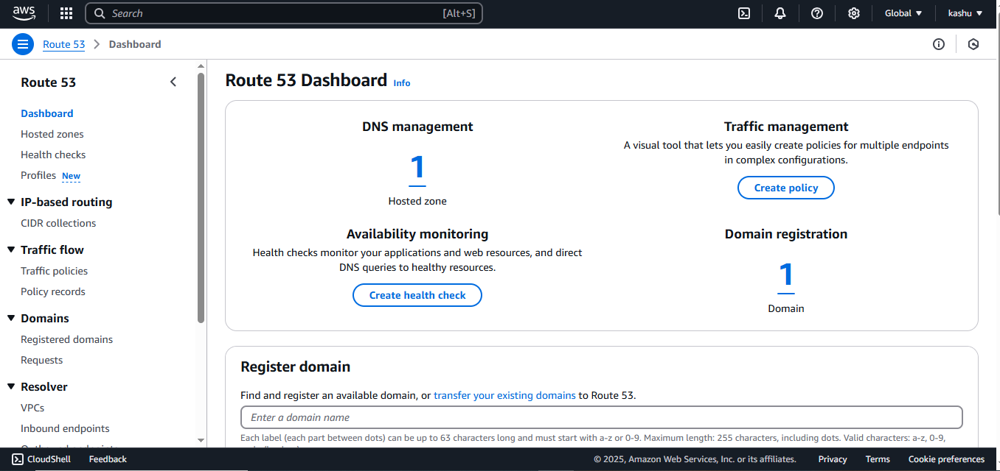

# ICT171 Cloud Project  
**Name:** Kashish Tulsibhai Manglani  
**Student Number:** 35258525  


Here is the link  to my website 
https://ict171kashish.click/<br>


<h1>**Pearl Threading Cloud Project**</h1>
           Pearl Threading is a beauty and self-care platform centered around professional threading and natural beauty
           treatments.Designed as a modern beauty service business, it offers a clean, comfortable environment where
           clients can receive expert threading, waxing, tinting, and henna treatments.The goal is to enhance personal
           confidence and self-expression through skilled, affordable, and culturally inspired beauty services.The core
           focus of Pearl Threading is the art of threading—an ancient, chemical-free technique of facial hair removal
           known for its precision, gentleness on skin, and ability to create clean, defined eyebrow shapes.
           This traditional method is complemented by additional services, including waxing, tinting, and henna designs to provide a 
           holistic approach to facial and skin grooming.
           <br>
<h3>**Let's start creating our website**</h3> 
---

## 🔧 EC2 Server Setup

To host the Pearl Threading website, I launched a virtual server using **Amazon EC2** (Ubuntu 22.04). The steps are listed below:

1. **Logged in** to AWS Management Console.
2. Navigated to **EC2 > Launch Instance**.
3. Selected:
   - **Ubuntu Server 22.04 LTS**
   - **t2.micro** (eligible for free tier)
4. Created a **new key pair** (e.g., `ict171keypair1-key.pem`) for SSH access.
5. Configured **Security Group rules**:
   - ✅ TCP 22 – SSH (My IP)
   - ✅ TCP 80 – HTTP (Anywhere)
6. Launched the instance and connected using this command:

```bash
ssh -i "ict171keypair1-key.pem" ubuntu@18.214.189.146
```
Below is a screenshot of the AWS EC2 Dashboard where I launched my virtual server for the Pearl Threading website:



   ## 🌐 Installing Apache Web Server

After connecting to my EC2 instance using SSH, I installed **Apache2**, the open-source web server software.

1. **Updated package lists:**

    ```bash
    sudo apt update
    ```

2. **Installed Apache2:**

    ```bash
    sudo apt install apache2
    ```

3. **Tested Apache by visiting:**

    ```
    http://18.214.189.146 or http://ict171kashish.click
    ```

If Apache is working, the browser shows the default Apache2 Ubuntu welcome page.

---

## 🖥️ Creating the Website with HTML & CSS

After confirming Apache was working, I created a simple custom website for **Pearl Threading** by editing the default Apache landing page.

1. **Opened the index.html file using nano:**

    ```bash
    sudo nano /var/www/html/index.html
    ```

2. **Wrote all my HTML and CSS manually inside this file.**  
   I included:
   - A homepage introducing Pearl Threading services
   - Service descriptions (e.g., eyebrow threading, facial threading, etc.)
   - Basic CSS styling using `<style>` tags within the same HTML file

3. **Saved and exited the file** by pressing `Ctrl + O`, `Enter`, then `Ctrl + X`.

4. **Tested the website** in my browser by visiting:

    ```
    http://18.214.189.146 or http://ict171kashish.click
    ```

The website successfully displayed my custom Pearl Threading homepage with all the content and styling I wrote inside `index.html`.


## 🖼️ Website Screenshot

Here is a screenshot of my Html and css code 





---

## 🌐 Assigning an Elastic IP to My EC2 Instance

To ensure my website has a stable and public-facing IP address, I assigned an **Elastic IP** to my EC2 instance. This prevents the IP from changing every time the instance restarts.

Here’s how I did it:

1. Navigated to **EC2 Dashboard > Elastic IPs**
2. Clicked **"Allocate Elastic IP address"**
3. Left default settings and clicked **Allocate**
4. Clicked **Actions > Associate Elastic IP address**
5. Chose my instance and private IP, then clicked **Associate**

### 📸 Elastic IP Screenshot

The screenshot below shows the Elastic IP I allocated (18.214.189.146) and how it appears in the AWS EC2 dashboard:



The Elastic IP I received was:
18.214.189.146


Now, even if I stop and start my EC2 instance, the public IP stays the same, which is essential for linking a custom domain.

---

## 🌍 Purchasing and Linking a Custom Domain Name (AWS Route 53)

To give my website a professional appearance and make it easier to access, I purchased the domain **ict171kashish.click** directly from **AWS Route 53**.

### Steps I followed:

1. Went to the **AWS Route 53 console**
2. Clicked on **"Registered domains" > Register domain**
3. Searched for `ict171kashish.click` and completed the payment process
4. Once registered, I went to **Route 53 > Hosted Zones**
5. Selected my domain and clicked **"Create Record"**
6. Added a new **A Record**:
   - **Record name**: *(left blank to use root domain)*
   - **Record type**: A - IPv4 address
   - **Value**: `18.214.189.146` (my Elastic IP)
   - **TTL**: 300 (default)
7. Saved the record and waited a few minutes for DNS to propagate

### 📸 Route 53 Domain Setup Screenshot

The screenshot below shows my AWS Route 53 dashboard, where I registered the domain `ict171kashish.click` and set up DNS management:




Now my website is publicly accessible at:  
👉 [http://ict171kashish.click](http://ict171kashish.click)

---

## 💡 JavaScript Feature

To add interactivity to my website, I included a simple JavaScript function that shows a pop-up alert when the user clicks a "Book Now" button.

### 📜 Code Snippet:

```html
<button onclick="showBooking()">Book Now</button>

<script>
  function showBooking() {
    alert("Thanks for choosing Pearl Threading! We'll contact you soon.");
  }
</script>


