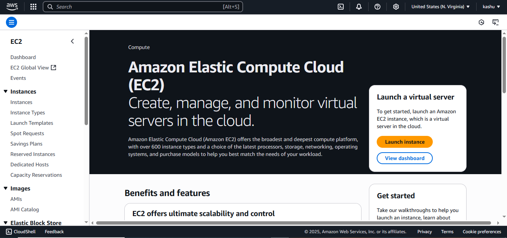
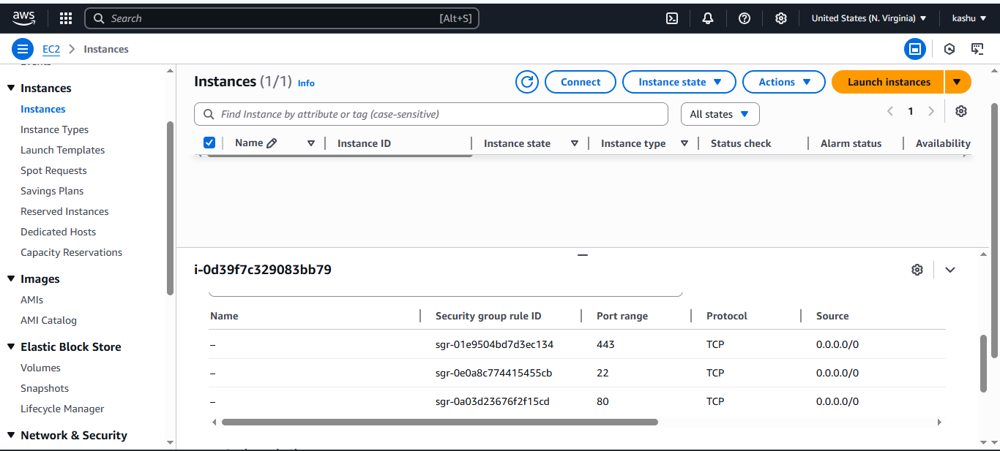
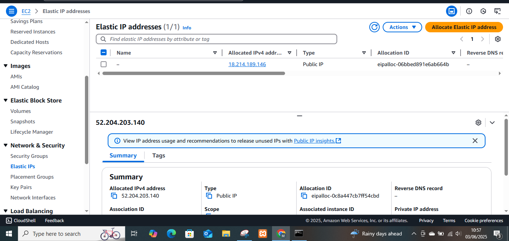
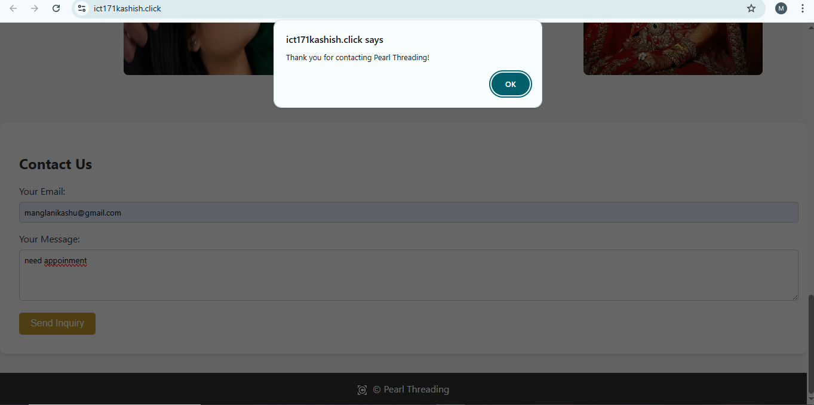
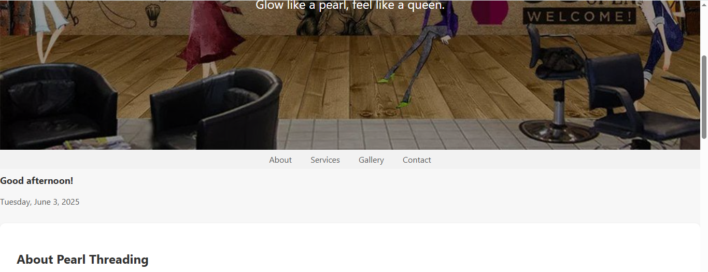

# ICT171 Cloud Project  
**Name:** Kashish Tulsibhai Manglani  
**Student Number:** 35258525  


Here is the link  to my website 
https://ict171kashish.click/<br>


<h1>**Pearl Threading Cloud Project**</h1>
           Pearl Threading is a beauty and self-care platform centered around professional threading and natural beauty
           treatments.Designed as a modern beauty service business, it offers a clean, comfortable environment where
           clients can receive expert threading, waxing, tinting, and henna treatments.The goal is to enhance personal
           confidence and self-expression through skilled, affordable, and culturally inspired beauty services.The core
           focus of Pearl Threading is the art of threading—an ancient, chemical-free technique of facial hair removal
           known for its precision, gentleness on skin, and ability to create clean, defined eyebrow shapes.
           This traditional method is complemented by additional services, including waxing, tinting, and henna designs to provide a 
           holistic approach to facial and skin grooming.
           <br>
<h3>**Let's start creating our website**</h3> 
---

## 🔧 EC2 Server Setup

To host the Pearl Threading website, I launched a virtual server using **Amazon EC2** (Ubuntu 22.04). The steps are listed below:

1. **Logged in** to AWS Management Console.
2. Navigated to **EC2 > Launch Instance**.
3. Selected:
   - **Ubuntu Server 22.04 LTS**
   - **t2.micro** (eligible for free tier)
4. Created a **new key pair** (e.g., `ict171keypair1-key.pem`) for SSH access.
5. Configured **Security Group rules**:
   - ✅ TCP 22 – SSH (My IP)
   - ✅ TCP 80 – HTTP (Anywhere)
6. Launched the instance and connected using this command:

```bash
ssh -i "ict171keypair1-key.pem" ubuntu@18.214.189.146
```
Below is a screenshot of the AWS EC2 Dashboard where I launched my virtual server for the Pearl Threading website:



---

### 🔐 AWS Security Group Configuration

To allow traffic to my EC2 instance, I edited the Security Group settings to open the required ports:

- **Port 22 (SSH)** – To connect via terminal
- **Port 80 (HTTP)** – To serve the website on regular web browsers
- **Port 443 (HTTPS)** – For future SSL/HTTPS setup

This ensures that:
- I can SSH into the server
- Users can access my website over HTTP
- The instance is ready for HTTPS if SSL is configured

### 📸 Security Group Screenshot:

The screenshot below shows the allowed TCP ports in my instance's security group:




   ## 🌐 Installing Apache Web Server

After connecting to my EC2 instance using SSH, I installed **Apache2**, the open-source web server software.

1. **Updated package lists:**

    ```bash
    sudo apt update
    ```

2. **Installed Apache2:**

    ```bash
    sudo apt install apache2
    ```

3. **Tested Apache by visiting:**

    ```
    http://18.214.189.146 or http://ict171kashish.click
    ```

If Apache is working, the browser shows the default Apache2 Ubuntu welcome page.

---

## 🖥️ Creating the Website with HTML & CSS

After confirming Apache was working, I created a simple custom website for **Pearl Threading** by editing the default Apache landing page.

1. **Opened the index.html file using nano:**

    ```bash
    sudo nano /var/www/html/index.html
    ```

2. **Wrote all my HTML and CSS manually inside this file.**  
   I included:
   - A homepage introducing Pearl Threading services
   - Service descriptions (e.g., eyebrow threading, facial threading, etc.)
   - Basic CSS styling using `<style>` tags within the same HTML file

3. **Saved and exited the file** by pressing `Ctrl + O`, `Enter`, then `Ctrl + X`.

4. **Tested the website** in my browser by visiting:

    ```
    http://18.214.189.146 or http://ict171kashish.click
    ```

The website successfully displayed my custom Pearl Threading homepage with all the content and styling I wrote inside `index.html`.


## 🖼️ Website Screenshot

Here is a screenshot of my Html and css code 


---
---

## 📄 Creating a Second Page: About Pearl Threading

To enhance the website functionality, I added a second HTML page named `about.html`.

This page provides visitors with background information about the Pearl Threading, including services, values, and booking encouragement.

### 🔗 Navigation:

- I added a link to `about.html` from the homepage (`index.html`)
- I also included a "Back to Home" link on the `about.html` page to return to the homepage

Visitors can now browse between:
- **Home Page:** [http://ict171kashish.click](http://ict171kashish.click)
- **About Page:** [http://ict171kashish.click/about.html](http://ict171kashish.click/about.html)

### 📸 About Page Screenshot:


## 🖼️ Creating a Gallery Page

To visually showcase the services offered by Pearl Threading, I created a `gallery.html` page. The page displays images of treatments like Bridal, Heena, Eyebrow, Facial, and Tinting in a responsive grid layout. Each image includes a label for clarity and better user experience. The gallery is styled using CSS to match the theme of the website.

📸 Gallery Page Screenshot  


## 🌐 Assigning an Elastic IP to My EC2 Instance

To ensure my website has a stable and public-facing IP address, I assigned an **Elastic IP** to my EC2 instance. This prevents the IP from changing every time the instance restarts.

Here’s how I did it:

1. Navigated to **EC2 Dashboard > Elastic IPs**
2. Clicked **"Allocate Elastic IP address"**
3. Left default settings and clicked **Allocate**
4. Clicked **Actions > Associate Elastic IP address**
5. Chose my instance and private IP, then clicked **Associate**

### 📸 Elastic IP Screenshot

The screenshot below shows the Elastic IP I allocated (18.214.189.146) and how it appears in the AWS EC2 dashboard:



The Elastic IP I received was:
18.214.189.146


Now, even if I stop and start my EC2 instance, the public IP stays the same, which is essential for linking a custom domain.

---

## 🌍 Purchasing and Linking a Custom Domain Name (AWS Route 53)

To give my website a professional appearance and make it easier to access, I purchased the domain **ict171kashish.click** directly from **AWS Route 53**.

### Steps I followed:

1. Went to the **AWS Route 53 console**
2. Clicked on **"Registered domains" > Register domain**
3. Searched for `ict171kashish.click` and completed the payment process
4. Once registered, I went to **Route 53 > Hosted Zones**
5. Selected my domain and clicked **"Create Record"**
6. Added a new **A Record**:
   - **Record name**: *(left blank to use root domain)*
   - **Record type**: A - IPv4 address
   - **Value**: `18.214.189.146` (my Elastic IP)
   - **TTL**: 300 (default)
7. Saved the record and waited a few minutes for DNS to propagate

### 📸 Route 53 Domain Setup Screenshot

The screenshot below shows my AWS Route 53 dashboard, where I registered the domain `ict171kashish.click` and set up DNS management:


Now my website is publicly accessible at:  
👉 [http://ict171kashish.click](http://ict171kashish.click)

---

## 💡 JavaScript Feature

To add interactivity to my website, I included a simple JavaScript function that shows a pop-up alert when the user clicks the "Send Inquiry" button.

### 📜 Code:

```html
<button onclick="showThankYou()">Send Inquiry</button>

<script>
  function showThankYou() {
    alert("Thank you for contacting Pearl Threading!");
  }
</script>

```
---

### 📸 Script Output Screenshot

The screenshot below shows the alert popup triggered when a user submits the contact form on the Pearl Threading website:



---

## 🧠 JavaScript Time & Date Greeting

I added a JavaScript script that automatically shows a time-based greeting ("Good morning!", "Good afternoon!") and today's date when a user visits the site.

This message appears right after the navbar to welcome the user dynamically.

### 📸 Screenshot:



---

## 🔒 Securing My Website with SSL (Let’s Encrypt)

To make my website more secure and enable **HTTPS**, I prepared my EC2 instance to support **SSL/TLS encryption** using **Let’s Encrypt** and **Certbot**.

### 🔧 Required Security Group Rule:
I enabled **Port 443 (TCP)** in my AWS EC2 security group to allow HTTPS traffic.

### 📋 Installation Steps (Planned or Completed):

I followed the university’s guide to installing SSL via Certbot:  
👉 [Obtaining a Digital Certificate from Let’s Encrypt](https://github.com/SCH-IT-MurdochUni/NetworkingLabs/blob/main/Server_Environments_and_Architectures/obtaining_a_digital_certificate_from_lets_encrypt.md)

Main steps include:

```bash
sudo apt update
sudo apt install certbot python3-certbot-apache -y
sudo certbot --apache
```

### 📸 SSL Setup Screenshot

The screenshot below shows that **port 443** has been opened in my EC2 security group, making my instance ready to install an SSL certificate via Let's Encrypt:


## 🎥 Video Walkthrough 

This section will include a short video showing how I:

- Launched my EC2 instance
- Installed Apache
- Created and tested the website using nano
- Assigned an Elastic IP and linked my Route 53 domain

🎬 [Watch the video here](https://your-video-link.com)


